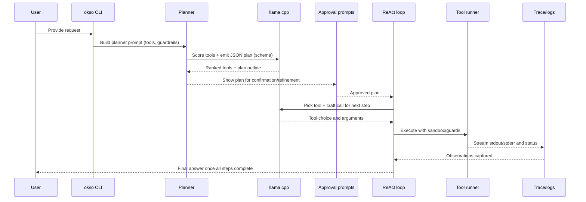

# Architecture

This page follows a typical run from the first prompt through tool execution so you can see where planning happens, when llama.cpp is invoked, and how tools are ranked and executed.

## End-to-end flow

Use `--dry-run` to stop after plan generation and approvals if you want to inspect the flow without executing tools.

## Planner pass

- Builds a structured prompt listing available tools, safety notes, and the user request.
- Requests a numbered outline with tool selections and short rationales using the JSON schema in [`src/schemas/planner_plan.schema.json`](../reference/schemas.md).
- Prefers llama.cpp scoring when `LLAMA_BIN` is available; otherwise falls back to deterministic keyword ranking so the plan still completes.
- Streams the plan to the terminal and writes JSON when `OKSO_PLAN_OUTPUT` is set before moving to approvals.

## ReAct loop

- Iterates through approved plan items, sending the running transcript and the current step to llama.cpp before each tool call.
- Collects the model's suggested tool and arguments, executes that tool, and streams observations back into the transcript.
- When `USE_REACT_LLAMA=false` or llama.cpp is unavailable, replays each planned tool deterministically using the original user query and the step context.
- Stops after `final_answer` emits the user-facing result or when a tool returns a fatal error.

### Step-by-step execution checklist

1. Load approved plan and active transcript.
2. If ReAct is enabled, query llama.cpp for the next tool call; otherwise use the planned tool in order.
3. Run the tool with its sandbox (for example, the terminal's guarded `rm -i` or the Python REPL sandbox).
4. Record stdout/stderr, exit status, and traces under `OKSO_TRACE_DIR` when configured.
5. Append the observation to the transcript and continue until all steps are finished.

## llama.cpp dependency and fallbacks

- `LLAMA_BIN` controls the llama.cpp binary path. If it is unset or unavailable, okso switches to deterministic planning and tool replay so execution continues without the model.
- `MODEL_SPEC` selects the model weights used by llama.cpp; defaults are provided in [`configuration`](../reference/configuration.md).
- `TESTING_PASSTHROUGH=true` disables llama.cpp entirely for offline or CI runs while keeping deterministic behavior.
- Planner and ReAct prompts both use the schemas in [`src/schemas/`](../reference/schemas.md) so that outputs stay parseable even when models vary.

## Tool ranking and execution

- Tool metadata (name, description, command, safety notes) is bundled into the planner prompt so llama.cpp can rank them for the outline and initial suggestions.
- Without llama.cpp, a keyword heuristic orders tools; this ordering is reused during deterministic execution.
- Each tool wrapper lives under `src/tools/` and enforces its own guards (sandboxed directories, platform checks, interactive deletes).
- The `terminal` tool keeps a persistent working directory per request, while helpers such as `python_repl`, `file_search`, and macOS-specific tools run in isolated contexts.
- Traces and logs for each invocation help you audit decisions and replay failures.
