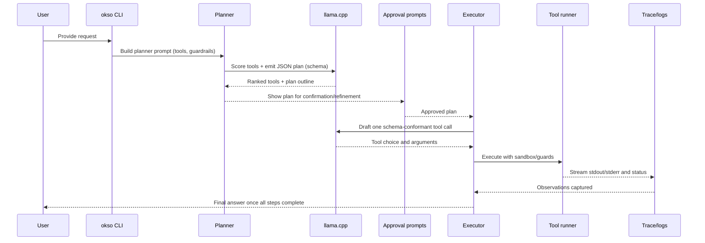

# Architecture

This page follows a typical run from the first prompt through tool execution so you can see where planning happens, when llama.cpp is invoked, and how tools are ranked and executed.

## End-to-end flow

Use `--dry-run` to stop after plan generation and approvals if you want to inspect the flow without executing tools.

## Planner pass

- Builds a structured prompt listing available tools, safety notes, and the user request.
- Requests a numbered outline with tool selections and short rationales using the JSON schema in [`src/schemas/planner_plan.schema.json`](../reference/schemas.md).
- Prefers llama.cpp scoring when `LLAMA_BIN` is available; otherwise falls back to deterministic keyword ranking so the plan still completes.
- Streams the plan to the terminal and writes JSON when `OKSO_PLAN_OUTPUT` is set before moving to approvals.

## Executor

- Requests one schema-constrained tool call from llama.cpp using the executor prompt (no persona or interaction transcript).
- Executes the chosen tool and streams observations; missing values are surfaced explicitly via the `__MISSING__` sentinel when the model cannot supply them.
- When `USE_REACT_LLAMA=false` or llama.cpp is unavailable, replays each planned tool deterministically using the original user query and the step context.
- Stops after `final_answer` emits the user-facing result or when a tool returns a fatal error.

### Step-by-step execution checklist

1. Load the approved plan and current step guidance.
2. If executor llama.cpp is enabled, query it for the next tool call; otherwise use the planned tool in order.
3. Run the tool with its sandbox (for example, the terminal's guarded `rm -i` or the Python REPL sandbox).
4. Record stdout/stderr, exit status, and traces under `OKSO_TRACE_DIR` when configured.
5. Continue until all planned steps are replayed or `final_answer` is returned.

## llama.cpp dependency and fallbacks

- `LLAMA_BIN` controls the llama.cpp binary path. If it is unset or unavailable, okso switches to deterministic planning and tool replay so execution continues without the model.
- `PLANNER_MODEL_SPEC` and `REACT_MODEL_SPEC` select the model weights used by llama.cpp for planning and tool selection respectively; defaults are provided in [`configuration`](../reference/configuration.md).
- `TESTING_PASSTHROUGH=true` disables llama.cpp entirely for offline or CI runs while keeping deterministic behavior.
- Planner and executor prompts both use the schemas in [`src/schemas/`](../reference/schemas.md) so that outputs stay parseable even when models vary.

## Tool ranking and execution

- Tool metadata (name, description, command, safety notes) is bundled into the planner prompt so llama.cpp can rank them for the outline and initial suggestions.
- Without llama.cpp, a keyword heuristic orders tools; this ordering is reused during deterministic execution.
- Each tool wrapper lives under `src/tools/` (with suites like `src/tools/web/` grouping related helpers) and enforces its own guards (sandboxed directories, platform checks, interactive deletes).
- The `terminal` tool keeps a persistent working directory per request, while helpers such as `python_repl` and macOS-specific tools run in isolated contexts.
- Traces and logs for each invocation help you audit decisions and replay failures.
